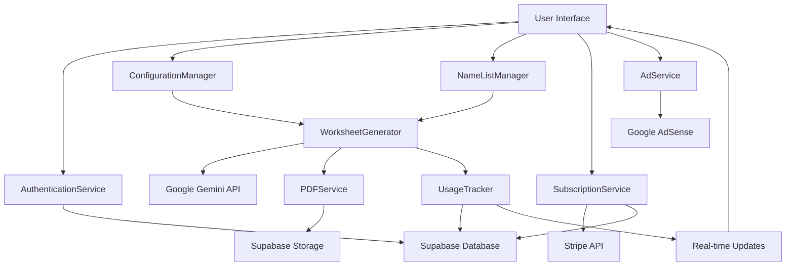

# Components

Based on the architectural patterns, tech stack, and data models, here are the major logical components across the fullstack:

## AuthenticationService

**Responsibility:** Handles Google OAuth integration, session management, and user authentication state across the application

**Key Interfaces:**
- signInWithGoogle(): Promise<User>
- signOut(): Promise<void>
- getCurrentUser(): User | null
- onAuthStateChange(callback): Unsubscribe

**Dependencies:** Supabase Auth, Google OAuth provider

**Technology Stack:** Supabase Auth client with Next.js middleware for route protection

## WorksheetGenerator

**Responsibility:** Core business logic for AI-powered worksheet generation, managing the complete pipeline from configuration to PDF output

**Key Interfaces:**
- generateWorksheet(config: GenerationConfig): Promise<WorksheetResult>
- validateUsageLimit(userId: string): Promise<boolean>
- saveGenerationRecord(generation: WorksheetGeneration): Promise<void>

**Dependencies:** Google Gemini API, Puppeteer service, UsageTracker, FileStorage

**Technology Stack:** Next.js API routes with Google Gemini integration and Puppeteer for PDF conversion

## ConfigurationManager

**Responsibility:** Manages worksheet configuration state, curriculum data, and user preference persistence

**Key Interfaces:**
- getCurriculumTopics(yearGroup: string): Topic[]
- getSubtopics(topic: string, yearGroup: string): Subtopic[]
- saveUserConfiguration(config: UserConfig): Promise<void>
- loadUserConfiguration(userId: string): Promise<UserConfig>

**Dependencies:** UserProfile service, curriculum data store

**Technology Stack:** Zustand for client state management, Supabase for persistence

## NameListManager

**Responsibility:** Handles creation, editing, and management of student name lists for personalized worksheet generation

**Key Interfaces:**
- createNameList(nameList: NameListInput): Promise<NameList>
- updateNameList(id: string, updates: NameListInput): Promise<void>
- deleteNameList(id: string): Promise<void>
- getUserNameLists(userId: string): Promise<NameList[]>

**Dependencies:** Database service, user authentication

**Technology Stack:** Next.js API routes with Supabase PostgreSQL

## UsageTracker

**Responsibility:** Monitors and enforces worksheet generation limits based on subscription tiers with real-time counter updates

**Key Interfaces:**
- incrementUsage(userId: string): Promise<UsageResult>
- getCurrentUsage(userId: string): Promise<UsageStats>
- resetMonthlyCounters(): Promise<void>
- checkUsageLimit(userId: string): Promise<boolean>

**Dependencies:** Subscription service, database service

**Technology Stack:** Supabase PostgreSQL with real-time subscriptions, database functions for atomic updates

## SubscriptionService

**Responsibility:** Manages user subscription tiers, Stripe integration, and payment processing workflows

**Key Interfaces:**
- createCheckoutSession(tier: SubscriptionTier): Promise<CheckoutSession>
- handleWebhook(event: StripeEvent): Promise<void>
- updateSubscription(userId: string, subscription: SubscriptionData): Promise<void>
- getCurrentSubscription(userId: string): Promise<Subscription>

**Dependencies:** Stripe API, webhook handlers, database service

**Technology Stack:** Stripe SDK with Next.js API routes, webhook signature verification

## Component Diagrams

