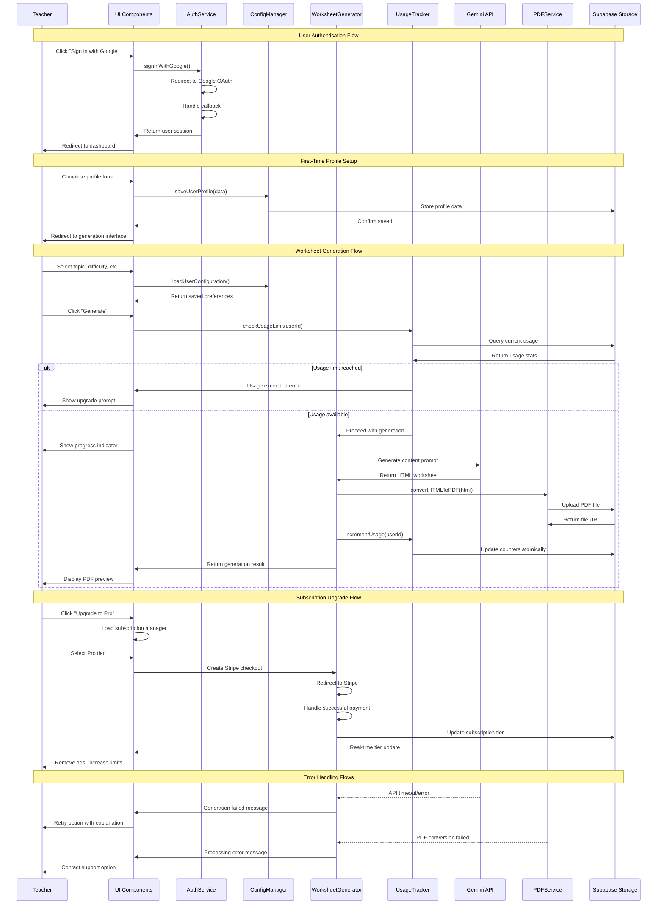

# Core Workflows

```mermaid
sequenceDiagram
    participant T as Teacher
    participant UI as UI Components
    participant Auth as AuthService
    participant Config as ConfigManager
    participant Gen as WorksheetGenerator
    participant Usage as UsageTracker
    participant Gemini as Gemini API
    participant PDF as PDFService
    participant Storage as Supabase Storage

    Note over T,Storage: User Authentication Flow
    T->>UI: Click "Sign in with Google"
    UI->>Auth: signInWithGoogle()
    Auth->>Auth: Redirect to Google OAuth
    Auth->>Auth: Handle callback
    Auth->>UI: Return user session
    UI->>T: Redirect to dashboard

    Note over T,Storage: First-Time Profile Setup
    T->>UI: Complete profile form
    UI->>Config: saveUserProfile(data)
    Config->>Storage: Store profile data
    Storage->>UI: Confirm saved
    UI->>T: Redirect to generation interface

    Note over T,Storage: Worksheet Generation Flow
    T->>UI: Select topic, difficulty, etc.
    UI->>Config: loadUserConfiguration()
    Config->>UI: Return saved preferences
    
    T->>UI: Click "Generate"
    UI->>Usage: checkUsageLimit(userId)
    Usage->>Storage: Query current usage
    Storage->>Usage: Return usage stats
    
    alt Usage limit reached
        Usage->>UI: Usage exceeded error
        UI->>T: Show upgrade prompt
    else Usage available
        Usage->>Gen: Proceed with generation
        UI->>T: Show progress indicator
        
        Gen->>Gemini: Generate content prompt
        Gemini->>Gen: Return HTML worksheet
        Gen->>PDF: convertHTMLToPDF(html)
        PDF->>Storage: Upload PDF file
        Storage->>PDF: Return file URL
        
        Gen->>Usage: incrementUsage(userId)
        Usage->>Storage: Update counters atomically
        
        Gen->>UI: Return generation result
        UI->>T: Display PDF preview
    end

    Note over T,Storage: Subscription Upgrade Flow
    T->>UI: Click "Upgrade to Pro"
    UI->>UI: Load subscription manager
    T->>UI: Select Pro tier
    UI->>Gen: Create Stripe checkout
    Gen->>Gen: Redirect to Stripe
    Gen->>Gen: Handle successful payment
    Gen->>Storage: Update subscription tier
    Storage->>UI: Real-time tier update
    UI->>T: Remove ads, increase limits

    Note over T,Storage: Error Handling Flows
    Gemini-->>Gen: API timeout/error
    Gen->>UI: Generation failed message
    UI->>T: Retry option with explanation
    
    PDF-->>Gen: PDF conversion failed
    Gen->>UI: Processing error message
    UI->>T: Contact support option
```