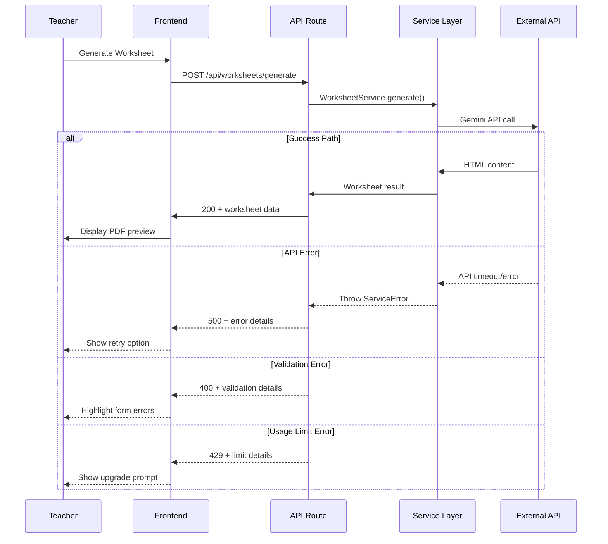

# Error Handling Strategy

## Error Flow



## Error Response Format

```typescript
interface ApiError {
  error: {
    code: string;
    message: string;
    details?: Record<string, any>;
    timestamp: string;
    requestId: string;
  };
  success: false;
}
```

*[This section would contain comprehensive error handling patterns, error recovery strategies, and user experience considerations as defined in the original architecture document.]*