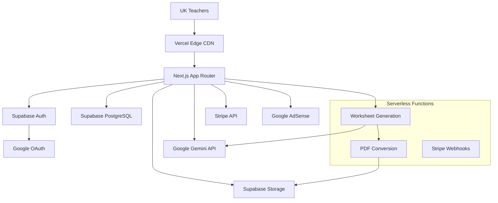

# High Level Architecture

## Technical Summary
WorksheetGenerator.AI employs a modern Jamstack architecture using Next.js 14 App Router as a fullstack framework, deployed on Vercel with Supabase providing authentication and database services. The frontend uses shadcn/ui components with Tailwind CSS for rapid development, while backend API routes handle AI integration with Google Gemini for worksheet generation and PDF conversion via Puppeteer. Key integration points include Supabase Auth for Google OAuth, Stripe for subscription management, and AdSense for revenue optimization. This architecture achieves the PRD's core goals of 5-7 second generation times, 99% uptime, and seamless teacher workflows through a streamlined technology stack optimized for single-developer rapid iteration.

## Platform and Infrastructure Choice

**Platform:** Vercel + Supabase  
**Key Services:** Next.js hosting, Serverless Functions, Supabase Auth/Database, Edge CDN  
**Deployment Host and Regions:** Global edge deployment with UK/Europe priority

This combination provides:
- **Rapid Development:** Minimal infrastructure management allows focus on business logic
- **Automatic Scaling:** Serverless functions handle concurrent worksheet generation efficiently  
- **Built-in Authentication:** Supabase Auth integrates seamlessly with Google OAuth for teacher Gmail accounts
- **Database & Real-time:** Supabase provides PostgreSQL with usage counters and subscription management
- **Performance:** Vercel's edge network ensures <3s page loads for UK teachers

## Repository Structure

**Structure:** Single Next.js monorepo  
**Monorepo Tool:** Native Next.js project structure (no additional tooling needed)  
**Package Organization:** App Router with co-located components and API routes

This approach optimizes for:
- Single developer workflow with Claude Code assistance
- Minimal complexity while supporting fullstack development
- Shared TypeScript types between frontend and backend
- Streamlined deployment pipeline

## High Level Architecture Diagram

## Architectural Patterns

- **Jamstack Architecture:** Pre-rendered pages with serverless API endpoints - _Rationale:_ Optimal performance and automatic scaling for educational SaaS
- **Component-Based UI:** Reusable shadcn/ui components with TypeScript - _Rationale:_ Rapid development and consistent design system
- **Pipeline Pattern:** Linear data flow from configuration → AI prompt → PDF generation - _Rationale:_ Simple, reliable worksheet generation workflow
- **Repository Pattern:** Abstract database operations through Supabase client - _Rationale:_ Clean data access and built-in security policies
- **Strategy Pattern:** Configurable AI prompts based on curriculum/difficulty - _Rationale:_ Curriculum-aligned content generation flexibility