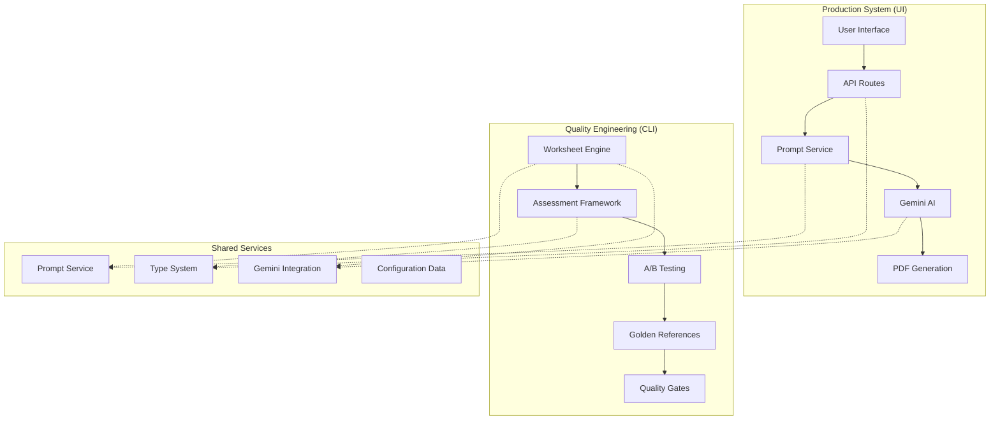

# Worksheet Generation System & Engine Documentation

## Table of Contents

1. [Executive Summary](#executive-summary)
2. [System Architecture Overview](#system-architecture-overview)
3. [Worksheet Generation Mechanism](#worksheet-generation-mechanism)
4. [Worksheet Engine (Quality Engineering Tool)](#worksheet-engine-quality-engineering-tool)
5. [Integration Points & Shared Services](#integration-points--shared-services)
6. [Quality & Performance Standards](#quality--performance-standards)
7. [Technical Implementation Details](#technical-implementation-details)
8. [Usage Guide](#usage-guide)
9. [Development & Maintenance](#development--maintenance)

---

## Executive Summary

The WorksheetGenerator.AI system is a sophisticated Next.js application that combines AI-driven content generation with systematic quality assurance. It features both a user-facing interface for rapid worksheet creation and a developer-focused quality engineering engine for iterative prompt optimization.

### Key Capabilities

- **Production System**: Generates curriculum-aligned worksheets in 5-7 seconds
- **Quality Engineering**: CLI-based tool for systematic prompt optimization with A/B testing
- **AI Integration**: Google Gemini 2.5 Flash with retry logic and performance metrics
- **Quality Assurance**: Multi-dimensional scoring system targeting ≥4.5/5.0 quality ratings
- **PDF Generation**: Professional formatting with cross-platform compatibility

---

## System Architecture Overview

### Dual Architecture Approach



### Core Components

1. **Frontend**: Next.js 13+ with App Router and TypeScript
2. **Backend**: Node.js API routes with comprehensive validation
3. **AI Service**: Google Gemini 2.5 Flash integration
4. **Quality Framework**: Multi-dimensional assessment and A/B testing
5. **PDF Pipeline**: Puppeteer-based HTML-to-PDF conversion

---

## Worksheet Generation Mechanism

### Generation Pipeline

```
User Configuration → Validation → Prompt Generation → AI Processing → HTML+SVG → PDF
```

### 1. Configuration System

**Location**: `src/lib/types/worksheet.ts`

```typescript
export interface WorksheetConfig {
  layout: LayoutType
  topic: string
  subtopic: string
  difficulty: DifficultyLevel
  questionCount: number
  yearGroup: string
  studentNames: string[]
  visualTheme?: VisualTheme
}
```

**Supported Configurations**:
- **Layouts**: Standard, Fluency, Grid, Differentiated, Reasoning, Visual-Heavy, Word-Problem-Enhanced
- **Difficulty Levels**: Easy, Average, Hard
- **Year Groups**: Reception through Year 6
- **Visual Themes**: Animals, Food, Sports, Space, Standard, None

### 2. API Layer

**Location**: `src/app/api/generate-worksheet/route.ts`

**Key Features**:
- Comprehensive input validation using Zod schemas
- Name list management with mock data integration
- Error handling with detailed feedback
- Performance metrics tracking
- CORS support for frontend integration

**Request Flow**:
```typescript
POST /api/generate-worksheet
{
  "layout": "standard",
  "topic": "addition-subtraction",
  "subtopic": "two-digit-numbers",
  "difficulty": "average",
  "questionCount": 5,
  "yearGroup": "Year 3",
  "nameList": "year3-class-a",
  "visualTheme": "animals"
}
```

### 3. Unified Prompt Service

**Location**: `src/lib/services/promptService.ts`

**Architecture**: Consolidated USP (Unified Service Platform) combining multiple prompt strategies

**Key Features**:
- **Iterative Quality Enhancement**: Targets ≥4.5/5.0 quality scores
- **Smart Configuration**: Handles enhanced options with intelligent defaults
- **Template Optimization**: Optimal prompt combining best elements from all approaches
- **Metadata Tracking**: Comprehensive generation metadata for quality improvement

**Prompt Generation Process**:
```typescript
export class PromptService {
  public static generatePrompt(
    config: WorksheetConfig,
    options: {
      forceEnhanced?: boolean
      iterativeCycle?: number
      targetQuality?: number
    } = {}
  ): { prompt: string; metadata: IterativeImprovementMetadata }
}
```

### 4. AI Integration

**Location**: `src/lib/services/gemini.ts`

**Configuration**:
- **Model**: Gemini 2.5 Flash
- **Temperature**: 0.7 (balanced creativity vs consistency)
- **Max Tokens**: 16,383
- **Retry Logic**: Up to 3 attempts with exponential backoff

**Key Features**:
- Comprehensive error handling with retry strategies
- Performance metrics tracking
- Standardized error reporting
- Rate limiting awareness

### 5. PDF Generation Pipeline

**Location**: `src/lib/services/pdfGenerationService.ts`

**Technical Stack**:
- **Engine**: Puppeteer with Chrome/Chromium
- **Format**: A4 with professional margins (20mm)
- **Features**: Print background, CSS page size optimization
- **Rate Limiting**: 5 PDFs per 3 minutes per user

**Cross-Platform Support**:
```typescript
// Production: @sparticuz/chromium for serverless
// Development: System Chrome detection with fallbacks
const systemChromePaths = [
  'C:\\Program Files\\Google\\Chrome\\Application\\chrome.exe', // Windows
  '/usr/bin/google-chrome-stable', // Linux
  '/Applications/Google Chrome.app/Contents/MacOS/Google Chrome' // macOS
]
```

---

## Worksheet Engine (Quality Engineering Tool)

### Purpose & Architecture

The Worksheet Engine is a **developer-only CLI tool** implementing the "Story Engine" architecture for systematic prompt optimization, quality assessment, and A/B testing.

### Story Engine Components

#### Story 1.1: Core Engine Infrastructure

**Location**: `src/worksheet-engine/cli/`

**Command-Line Interface** (`index.ts`):
- 40+ command options with comprehensive argument parsing
- Modular command routing to specialized handlers
- Context-aware error handling with suggestions

**Configuration Management**:
- Pre-defined worksheet configurations
- Flexible prompt variant system
- Structured output organization

#### Story 1.2: Quality Assessment Framework

**Location**: `src/worksheet-engine/assessment/`

**Multi-Dimensional Scoring System** (0-10 scale):

```typescript
export interface QualityScores {
  visualSimilarity: VisualSimilarityScore    // Layout consistency
  contentAnalysis: ContentAnalysisScore      // Curriculum alignment
  ruleBasedLayout: RuleBasedLayoutScore      // Design quality
  composite: number                          // Weighted average
}
```

**Assessment Components**:
- **Visual Similarity**: PDF-to-image comparison with structural analysis
- **Content Analysis**: Text extraction with curriculum validation
- **Rule-Based Layout**: Typography, spacing, and positioning checks
- **Composite Scoring**: Weighted calculation with configurable thresholds

#### Story 1.3: Golden Reference & A/B Testing

**Location**: `src/worksheet-engine/ab-testing/`, `src/worksheet-engine/golden-references/`

**Golden Reference System**:
- High-quality worksheet storage with versioning
- Approval workflow for quality standards
- Automated validation and integrity checks

**A/B Testing Framework**:
- Statistical significance testing (t-tests, p-values, effect sizes)
- Parallel execution support for performance optimization
- Regression detection against established baselines
- Comprehensive reporting with actionable recommendations

### Engine Command Reference

#### Basic Generation
```bash
npm run worksheet-engine -- --config="year3-addition-standard-average-5q" --prompt-variant="baseline" --output-dir="./results/test-001"
```

#### Quality Assessment
```bash
npm run worksheet-engine -- --config="config-id" --assess --golden-ref="reference-id"
```

#### A/B Testing
```bash
npm run worksheet-engine -- --ab-test --config="config-id" --variants="baseline,enhanced-v1,enhanced-v2" --iterations=5 --parallel
```

#### Golden Reference Management
```bash
# Create golden reference
npm run worksheet-engine -- --create-golden --config="config-id" --source="high-quality-pdf" --approve

# List references
npm run worksheet-engine -- --list-golden --filter="year3"

# Validate references
npm run worksheet-engine -- --validate-golden
```

#### Quality Gates
```bash
npm run worksheet-engine -- --quality-gates --config="config-id" --custom-thresholds="thresholds.json"
```

#### Reporting
```bash
npm run worksheet-engine -- --generate-report --report-type="quality-summary" --time-range="last-30-days" --output-dir="./reports"
```

### Automation Framework

**Complete 6-Phase Workflow** (`scripts/prompt-engineering-automation.js`):

1. **Baseline Generation**: Create initial quality benchmarks
2. **Golden Reference**: Establish quality standards
3. **Variant Testing**: Compare prompt improvements
4. **A/B Testing**: Statistical validation of variants
5. **Quality Gates**: Ensure minimum quality thresholds
6. **Reporting**: Comprehensive analysis with recommendations

```bash
# Run complete automation workflow
npm run prompt-automation

# Custom configuration
CONFIG_ID=year4-multiplication-advanced-hard-8q npm run prompt-automation

# Environment variables
export ITERATIONS=10
export MIN_COMPOSITE_SCORE=8.0
export PARALLEL=true
npm run prompt-automation
```

---

## Integration Points & Shared Services

### Service Architecture

Both UI and Engine systems share core services for consistency:

```typescript
// Shared Services
- PromptService: Unified prompt generation
- GeminiService: AI integration with retry logic
- TypeSystem: Centralized type definitions
- ConfigurationData: Curriculum and layout data
```

### File Organization

```
src/
├── lib/
│   ├── services/           # Shared services (prompt, gemini, pdf)
│   │   ├── promptService.ts
│   │   ├── gemini.ts
│   │   └── pdfGenerationService.ts
│   ├── types/             # Centralized type definitions
│   │   └── worksheet.ts
│   ├── data/              # Curriculum and configuration data
│   │   ├── curriculum.ts
│   │   └── layouts.ts
│   └── utils/             # Shared utilities
│       ├── validation.ts
│       └── errorHandling.ts
├── app/api/               # Next.js API routes
│   ├── generate-worksheet/
│   └── worksheets/generate-pdf/
└── worksheet-engine/      # CLI tool and quality framework
    ├── cli/               # Command-line interface
    ├── assessment/        # Multi-dimensional quality scoring
    ├── ab-testing/        # Statistical testing framework
    ├── golden-references/ # Quality standard management
    ├── quality-gates/     # Deployment validation
    ├── reporting/         # Analysis and recommendations
    └── types/             # Engine-specific types
```

---

## Quality & Performance Standards

### Quality Targets

| System | Target Score | Purpose |
|--------|-------------|---------|
| UI System | ≥4.0/5.0 | Production worksheet quality |
| Engine System | ≥4.5/5.0 | Iterative optimization target |
| Phase 1 Combinations | ≥4.5/5.0 | Priority configuration targets |

### Performance Standards

| Metric | Target | Measurement |
|--------|--------|-------------|
| Generation Time (UI) | 5-7 seconds | End-to-end including PDF |
| Assessment Time | <30 seconds | Per worksheet with scoring |
| PDF Generation | 2-3 seconds | Post-generation download |
| API Response | <2 seconds | Worksheet content generation |

### Quality Dimensions

```typescript
interface QualityMetrics {
  visualAppeal: number                // 25% weight - Layout and design
  educationalAppropriateness: number  // 25% weight - Age and curriculum fit
  svgIntegration: number             // 20% weight - Visual element quality
  curriculumAlignment: number        // 15% weight - Standards compliance
  accessibility: number              // 15% weight - Inclusive design
  totalScore: number                 // Weighted composite
}
```

---

## Technical Implementation Details

### Environment Requirements

**Development Environment**:
```bash
# Required
Node.js 18+
TypeScript 5+
Next.js 13+
GEMINI_API_KEY environment variable

# PDF Generation
Chrome/Chromium executable (auto-detected)
Puppeteer dependencies

# Optional (Production)
@sparticuz/chromium for serverless deployment
```

### Configuration Setup

**Environment Variables**:
```bash
# Required
GEMINI_API_KEY=your_gemini_api_key

# Optional
NODE_ENV=development|production
CONFIG_ID=year3-addition-standard-average-5q
ITERATIONS=5
MIN_COMPOSITE_SCORE=7.5
BASE_OUTPUT_DIR=./prompt-engineering-results
```

### Error Handling Strategy

**Standardized Error Classes**:
```typescript
- APIError: External service failures with retry flags
- ValidationError: Input validation with detailed field errors
- GenerationError: Content generation failures
- CliError: Command-line specific errors with context
```

**Error Response Format**:
```typescript
interface ErrorResponse {
  success: false
  error: string
  message: string
  generationTime: number
  timestamp: string
  details?: unknown
}
```

### Security Implementation

**Input Sanitization**:
- XSS prevention in HTML content processing
- SQL injection protection in configuration queries
- File path validation for output directories

**Rate Limiting**:
- Per-user PDF generation limits (5 per 3 minutes)
- API request throttling
- Resource usage monitoring

**Data Privacy**:
- No personal data in logs or error messages
- Sanitized configuration tracking
- Secure file naming conventions

---

## Usage Guide

### For Developers (UI System)

**Basic Worksheet Generation**:
```typescript
// API call from frontend
const response = await fetch('/api/generate-worksheet', {
  method: 'POST',
  headers: { 'Content-Type': 'application/json' },
  body: JSON.stringify({
    layout: 'standard',
    topic: 'addition-subtraction',
    subtopic: 'two-digit-numbers',
    difficulty: 'average',
    questionCount: 5,
    yearGroup: 'Year 3',
    nameList: 'year3-class-a'
  })
});

const result = await response.json();
```

### For Quality Engineers (Engine System)

**Quick Start**:
```bash
# 1. List available configurations
npm run worksheet-engine -- --list-configs

# 2. Generate and assess a worksheet
npm run worksheet-engine -- --config="year3-addition-standard-average-5q" --assess

# 3. Run complete optimization workflow
npm run prompt-automation
```

**Custom A/B Testing**:
```bash
# Compare prompt variants
npm run worksheet-engine -- \
  --ab-test \
  --config="year4-multiplication-advanced-hard-8q" \
  --variants="baseline,enhanced-v1,enhanced-v2" \
  --iterations=10 \
  --parallel \
  --output-dir="./custom-ab-test"
```

### Configuration Management

**Predefined Configurations**:
- `year3-addition-standard-average-5q`: Year 3 addition, 5 questions
- `year4-multiplication-advanced-hard-8q`: Year 4 multiplication, 8 questions
- `reception-counting-visual-easy-3q`: Reception counting, 3 questions

**Custom Configuration Creation**:
```typescript
// Define in src/worksheet-engine/config/presets.ts
export const CUSTOM_CONFIG: ConfigMapping = {
  'custom-year5-fractions': {
    layout: 'visual-heavy',
    yearGroup: 'Year 5',
    topic: 'fractions',
    subtopic: 'equivalent-fractions',
    difficulty: 'average',
    questionCount: 6
  }
}
```

---

## Development & Maintenance

### Code Standards

**TypeScript Configuration**:
- Strict mode enabled
- No implicit any
- Path mapping for clean imports
- Comprehensive type coverage

**Testing Strategy**:
- Unit tests for core services
- Integration tests for API endpoints
- Quality assessment validation
- End-to-end automation testing

### Monitoring & Logging

**Production Monitoring**:
```typescript
// Performance metrics
interface GenerationMetrics {
  startTime: number
  endTime: number
  duration: number
  promptLength: number
  responseLength: number
  success: boolean
  errorType?: string
}
```

**Quality Tracking**:
- Continuous quality score monitoring
- Regression detection alerts
- Performance degradation warnings
- User experience metrics

### Deployment Considerations

**Environment-Specific Configuration**:
- Development: Local Chrome with full debugging
- Production: Serverless Chrome with optimized performance
- Testing: Mock services with controlled responses

**Scaling Strategies**:
- Horizontal scaling for API endpoints
- Queue-based processing for batch operations
- Caching for static assets and prompt templates
- CDN integration for PDF delivery

### Maintenance Tasks

**Regular Maintenance**:
```bash
# Clean up rate limit store
# Update golden references
# Validate quality thresholds
# Performance optimization
# Security updates
```

**Quality Assurance**:
- Weekly quality metric reviews
- Monthly golden reference updates
- Quarterly prompt optimization cycles
- Annual curriculum alignment validation

---

## Conclusion

The WorksheetGenerator.AI system represents a sophisticated dual-architecture approach that balances production reliability with systematic quality improvement:

1. **Production System**: Optimized for end-user experience with rapid generation and high reliability
2. **Quality Engineering**: Developer-focused tools for continuous improvement through data-driven optimization

This architecture enables both immediate value delivery to educators and long-term quality enhancement through systematic prompt engineering and quality assurance processes.

The integration of AI generation with comprehensive quality frameworks ensures that the system can rapidly deploy new capabilities while maintaining and improving educational quality standards over time.